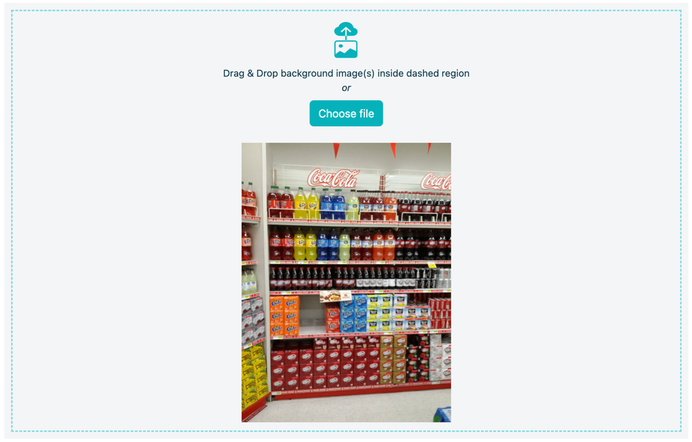
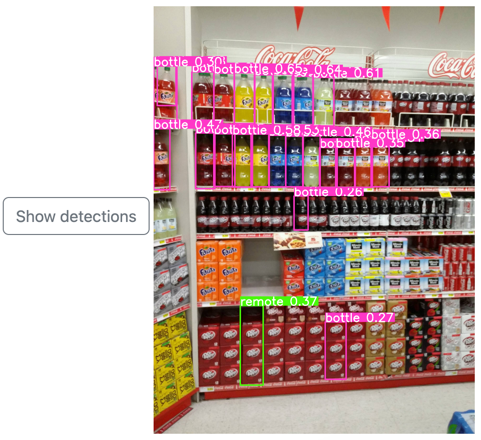

# Product Detector Demo Application

> **DISCLAIMER**: This is a proof-of-concept application with the aim to demonstrate
> deployment of YOLOv8n model

Web application allows to detect products (bottles) on shop shelves. This task is commonly called
**Retail Store Item Detection** or **Retail Object Detection** [1], [2].

Web application exposes simple UI that allows a user to Drag&Drop a photo from a shop and get
an image with each identified product (bottle).

Web application is built on top of YOLOv8n model that was delivered by Ultralytics company in 2022.
[Pre-trained version](https://docs.ultralytics.com/models/yolov8/#supported-tasks)
of a model is taken from publicly available storage.

## Plan of work

Selected track: **Product**

|Stage | Status |
|:---|:---|
| Problem search and solution description | ✅ |
| Search for pretrained model and corresponding dataset | ✅ |
| Framework selection | ✅ |
| Development of MVP | ✅ |
| Integration of model in MVP | ✅ |
| Testing demo | ✅ |
| Deployment | ✅ |

### 1. Problem search and solution description

1. Problem solved: **Retail Object Detection** [2]. Identification of bottles on a shop shelve.
2. Target audience: **Shop administrators**, **forwarders**
3. Optimal way for model deployment: **Web application**. Mobile application would require more
   efforts due to two major OSes and numerous minor versions.

### 2. Search for pretrained model and corresponding dataset

1. Selected model: [YOLOv8n](https://docs.ultralytics.com/models/yolov8/#supported-tasks)
2. Selected dataset: [SKU110K dataset](https://github.com/eg4000/SKU110K_CVPR19)

### 3. Framework selection

Solution is based on:

1. [FastAPI](https://fastapi.tiangolo.com/) - framework for building web applications
   that expose REST API and serve static files
2. [Bootstrap](https://getbootstrap.com/) - library for building responsive UI for web applications
3. [PyTorch](https://pytorch.org/) - framework for designing DL pipelines, training and inference
   of DL models
4. [Ultralytics](https://docs.ultralytics.com/) - library for working with YOLO models
5. [Docker](https://www.docker.com/) - containerizing solution for web applications
6. [Yandex.Cloud](https://cloud.yandex.ru/) - IaaS cloud provider

### 4. Development of MVP

Code is located in  folder:

*  - UI for application
*  - server code with all REST API endpoint

### 5. Integration of model in MVP

Code is located in  folder:

*  - server code for executing YOLO model

### 6. Testing demo

**Proposed test scenario:**

1. Download [image](img/test_7.jpg). This image is taken solely for academic purposes from
   [SKU110K dataset](https://github.com/eg4000/SKU110K_CVPR19). Please do not re-distribute it.
2. Open Web application: [http://158.160.28.22/](http://158.160.28.22/)
3. Select this image:

   
4. Click **Upload & Run model**
5. Click **Show detections**
6. Inspect results:

   

Not all bottles are detected correctly, thus meaning that model requires fine-tuning for a
particular task.

Code quality is automatically (per each PR/push to main branch) checked with:

1. [GitHub Actions](https://github.com/features/actions) - platform for running automated checks
2. [black](https://pypi.org/project/black/) - library for automatic formatting of code
   according to pre-defined rules
3. [mypy](https://pypi.org/project/mypy/) - library for static type checking
4. [pylint](https://pypi.org/project/pylint/) - library for evaluating code style
   (traditional and well-respected)
5. [ruff](https://pypi.org/project/ruff/) - library for evaluating code style
   (experimental and very hot to this moment)

### 7. Deployment

Web application is available as:

* **Web-service** - [http://158.160.28.22/](http://158.160.28.22/)
  (might be not available as it is configured as _interrupted Cloud VM_ - it is
  the cheapest cloud option. Write to monadv@yandex.ru and request to start it again)
* **locally run Docker container** - follow instructions from a corresponding section below.
* **locally run from sources** - follow instructions from a corresponding section below to run it
  from sources.

All deployment instructions are present in [DEVELOPER.md](DEVELOPER.md).

[1]: https://blog.roboflow.com/retail-store-item-detection-using-yolov5/

[2]: https://catalog.ngc.nvidia.com/orgs/nvidia/teams/tao/models/retail_object_detection
